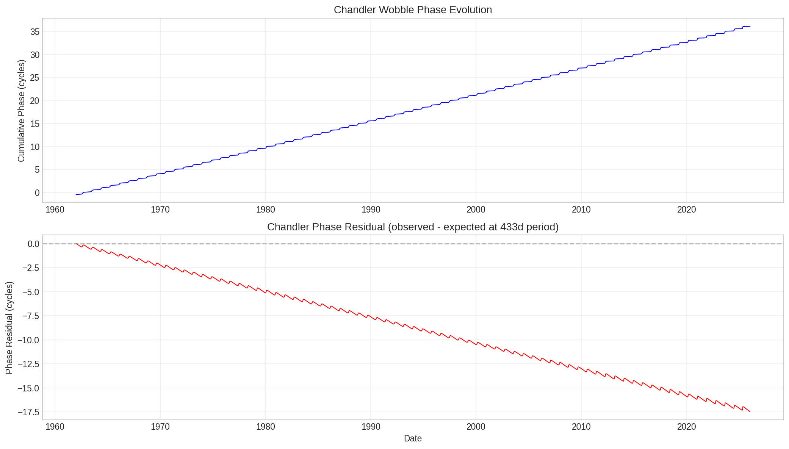
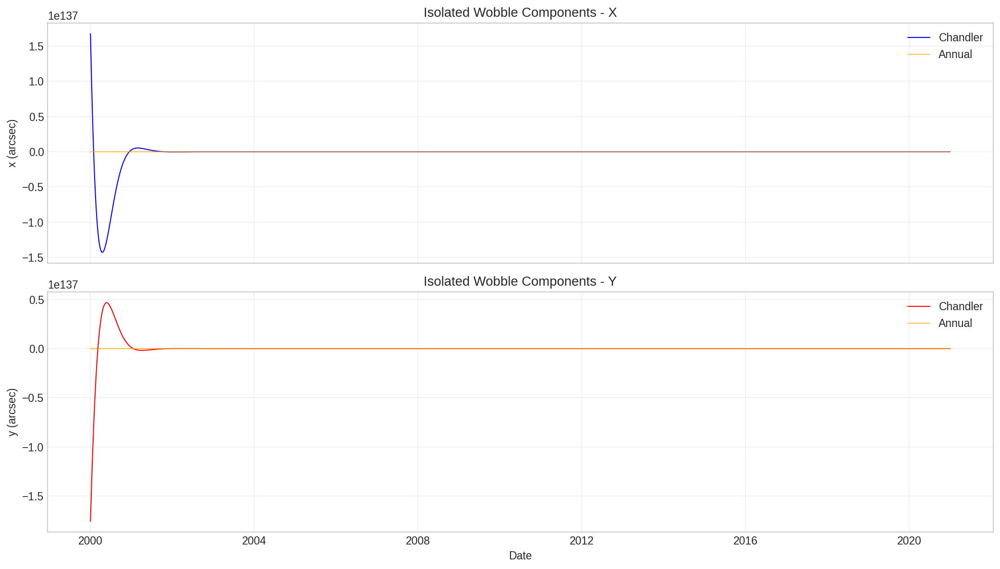
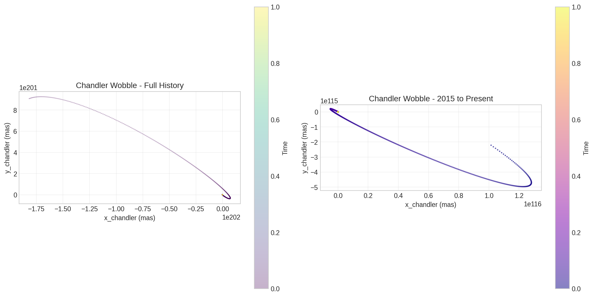
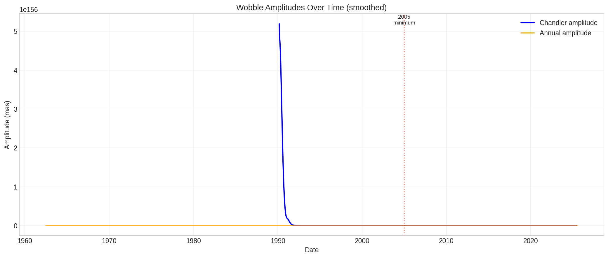
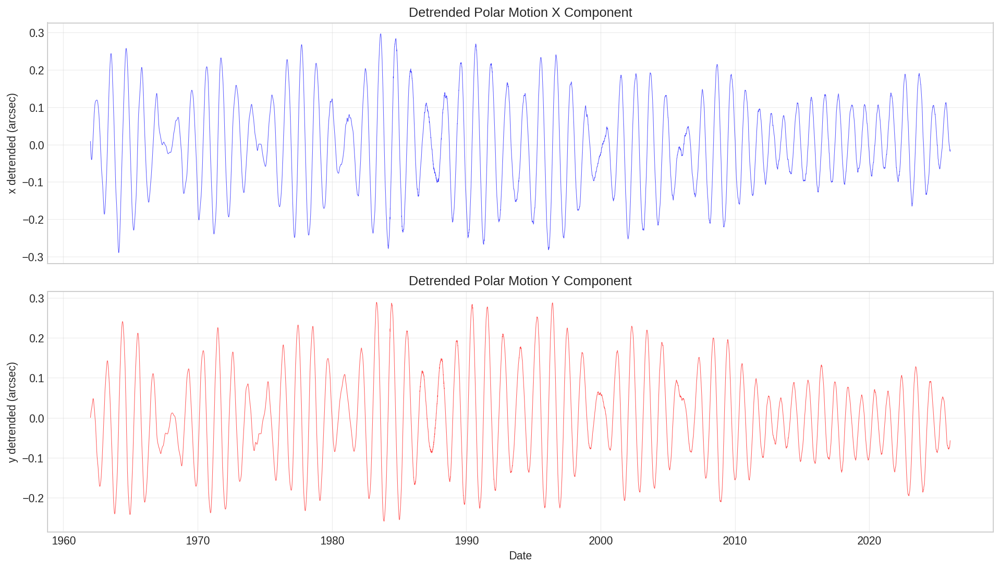
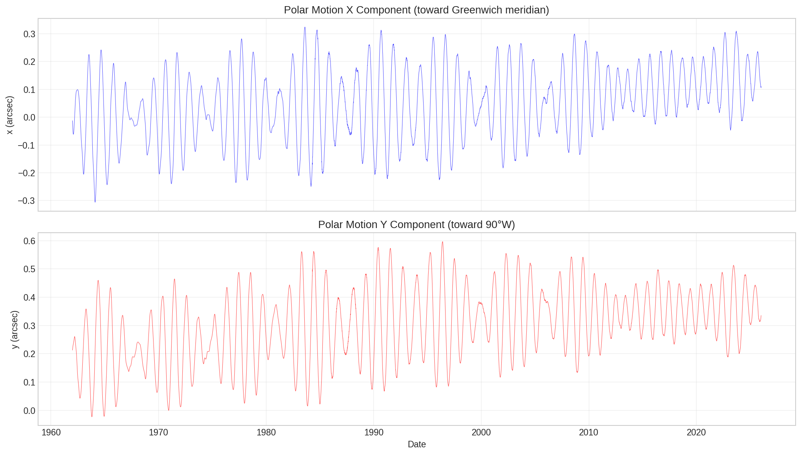
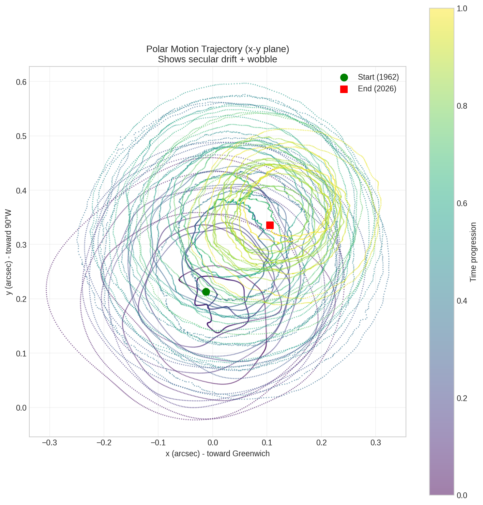
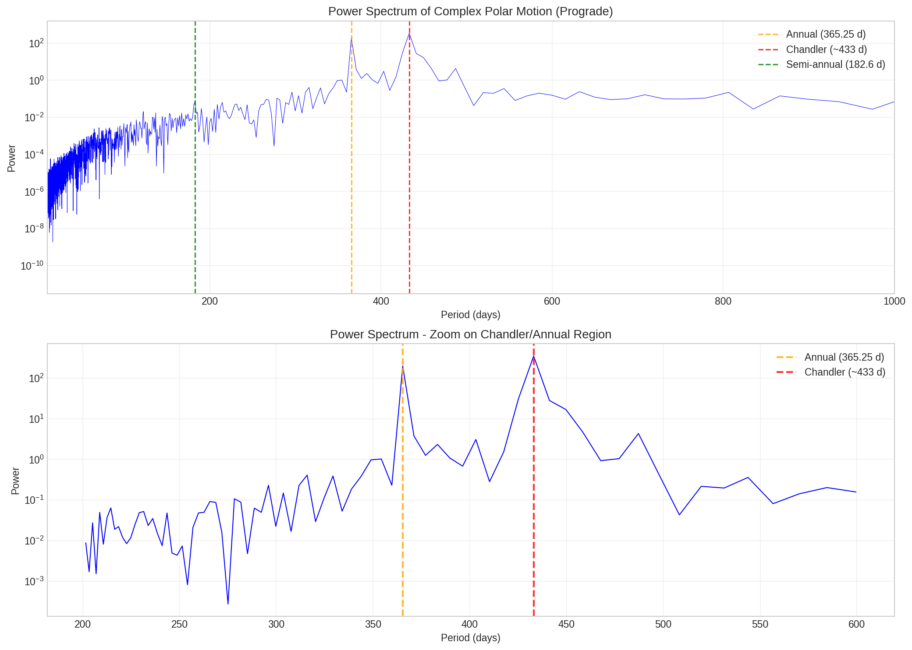

# Generated Figures

*Auto-generated on 2026-02-09 00:33:58 UTC*

This document contains figures generated from the analysis notebooks.

## Table of Contents

- [Chandler Wobble](#chandler-wobble)
- [Polar Motion](#polar-motion)
- [Spectral Analysis](#spectral-analysis)
- [Data Files](#data-files)

## Chandler Wobble

### Chandler Phase Analysis

Phase evolution and residuals from expected 433-day period.

### Chandler vs Annual Wobble

Band-pass filtered components isolating Chandler and annual wobbles.

### Chandler Wobble Trajectory

Isolated Chandler wobble motion in the x-y plane.

### Wobble Amplitude Evolution

Time series of Chandler and annual wobble amplitudes (smoothed).

## Polar Motion

### Detrended Polar Motion

Polar motion with linear trend (secular drift) removed.

### Raw Polar Motion Time Series

X and Y components of polar motion from IERS EOP C04 data (1962-present).

### Polar Motion Trajectory

Path of the pole in the x-y plane showing secular drift and wobble.

## Spectral Analysis

### Polar Motion Power Spectrum

FFT power spectrum showing peaks at Chandler (~433d) and annual (~365d) periods.

## Data Files

Summary data files generated by the analysis:

- [chandler_wobble_summary.csv](figures/chandler_wobble_summary.csv)
- [chandler_wobble_summary.md](figures/chandler_wobble_summary.md)
